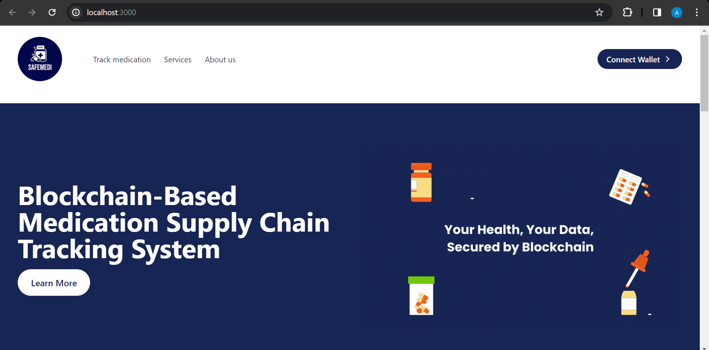
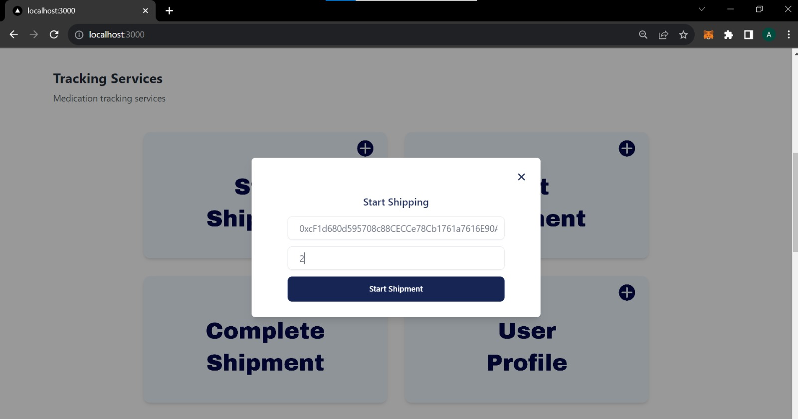
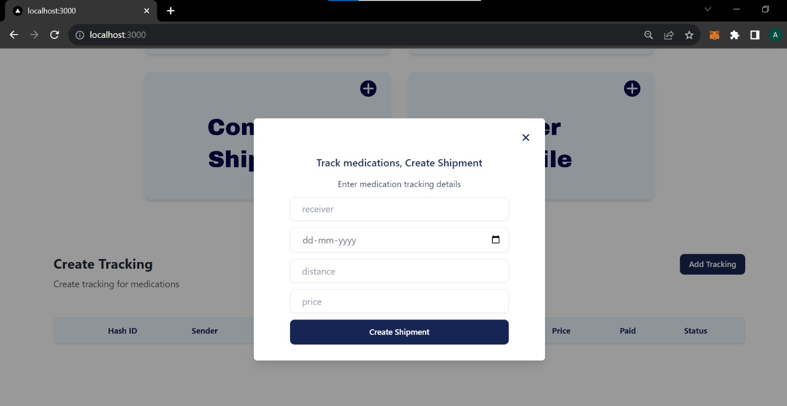
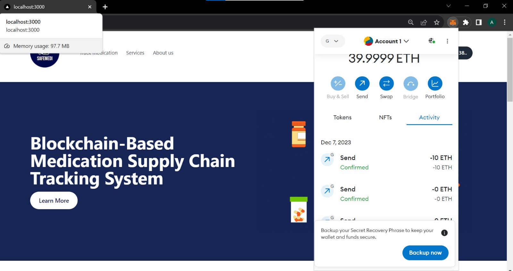
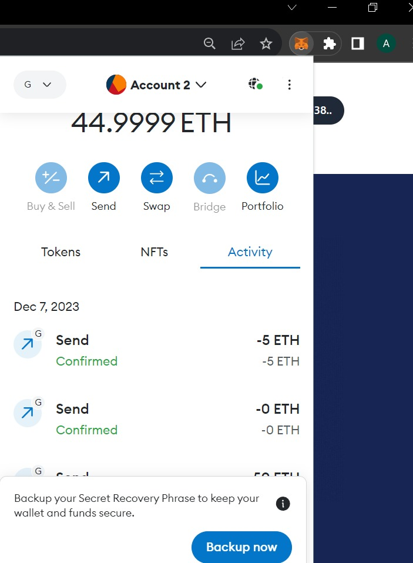
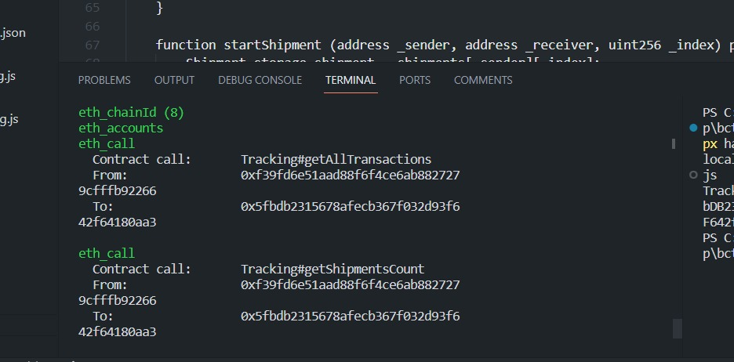

# Pharmaceutical Supply Chain Tracking System

## Description

This project introduces a medication supply chain tracking system utilizing blockchain technology. The implementation enhances transparency and traceability in the pharmaceutical industry by leveraging the decentralized and immutable nature of blockchain. Through this system, stakeholders in the supply chain, including manufacturers, distributors, and retailers, can securely record and verify the journey of medications from production to distribution.

## Prerequisites

Ensure you have the following prerequisites installed before running the project:

- **Node.js:** Make sure you have Node.js installed on your machine. You can download it from [https://nodejs.org/](https://nodejs.org/).

- **Hardhat:** Install Hardhat, a development environment for Ethereum. You can install it globally using:

  ```bash
  npm install -g hardhat


Getting Started
Follow these steps to run the medication supply chain tracking system:

Clone the Repository:
```bash
git clone https://github.com/ArjunN02/PharmaSupplyChain-bct.git
```
Navigate to the Project Directory:
```bash
cd PharmaSupplyChain-bct
```
Install Dependencies:
```bash
npm install
```
Run Hardhat Node:

Start a local Ethereum node using Hardhat:
```bash
npx hardhat node
```
Deploy Smart Contracts:

In a new terminal, deploy the smart contracts to the local network:
```bash
npx hardhat run --network localhost scripts/deploy.js
```
Run the Development Server:

Start the development server to run the user interface:
```bash
npm run dev
```
Access the Application:

Open your web browser and visit http://localhost:3000 to interact with the medication supply chain tracking system.

Now you have the medication supply chain tracking system up and running locally. Feel free to explore the application and test its functionality in the development environment.
## Screenshots








## Project Folder 

https://drive.google.com/drive/folders/1yXaxl6eebQ4kOiaqnz_V4t2Lh8wpeN07

